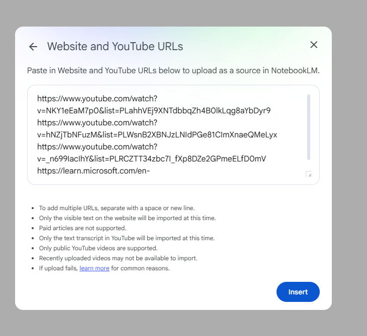
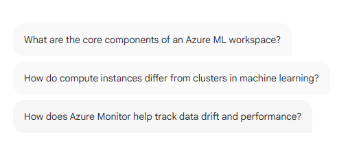

# Projeto Um Bootcamp DIO Bradesco

**Objetivo:** Apresentar a utilização de uma _GenIA_ de forma prática.
A ferramenta escolhida foi o _NotebookLM_ do Google e foco do uso será a produtividade nos estudos.

## Escolha do Conteúdo

O conteúdo escolhido foi o conteúdo da certificação _Azure DP-100_ da Microsoft para o qual estou estudando no momento atual.

## Escolha da Fontes do Conteúdo

As fontes selecionadas foram: três playlists no Youtube (sendo um oficial da Microsoft)  e o site oficial da Microsoft Learn com o roteiro e o conteúdo da certificação.

## A Criação do Conteúdo no NotebookLM

Todos os conteúdos foram adicionados ao NotebookLM:

NotebookLM pronto após carregar o conteúdo:

A própria IA resume o conteúdo enviado, informando que é um guia de estudo para a certificação Azure e aponta os principais tópicos do conteúdo encontrado.

## Prompts

A própria IA oferece algumas opções de prompts (em inglês):

## Fontes Utilizadas

[Study Guide for Exam DP-100: Designing and Implementing a Data Science Solution on Azure](https://learn.microsoft.com/en-us/credentials/certifications/resources/study-guides/dp-100)

[Design a machine learning solution DP-100 | Playlist no Youtube da Microsoft Learn](https://www.youtube.com/watch?v=NKY1eEaM7p0&list=PLahhVEj9XNTdbbqZh4B0lkLqg8aYbDyr9)

[How to pass Exam DP-100 Azure Data Scientist | Playlist no Youtube do
E Learning Free Channel](https://www.youtube.com/watch?v=hNZjTbNFuzM&list=PLWsnB2XBNJzLNIdPGe81CImXnaeQMeLyx)

[ Azure Machine Learning Tutorial | Vijay Gadhave](https://www.youtube.com/watch?v=_n699IacIhY&list=PLRCZTT34zbc7I_fXp8DZe2GPmeELfD0mV)

